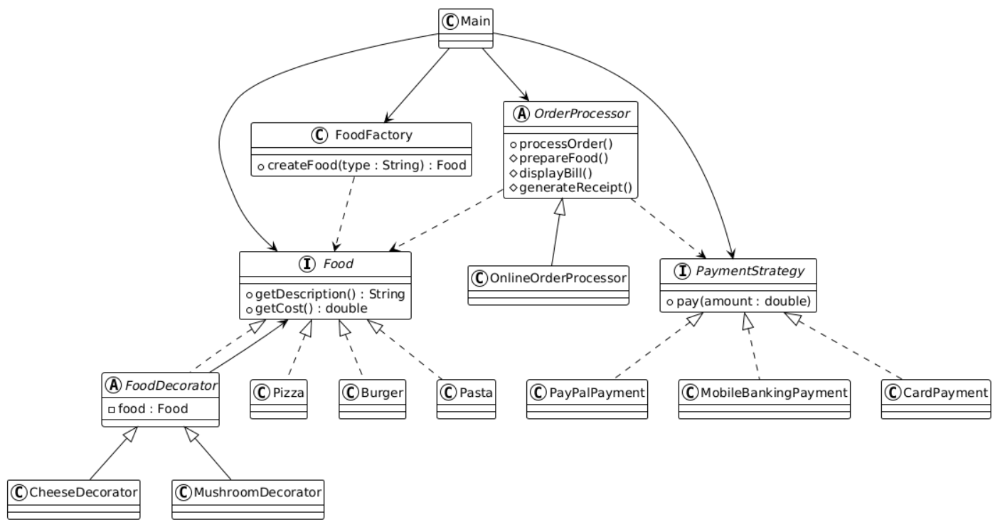

# Online Food Ordering System using Design Patterns

## Project Overview

This project demonstrates the implementation of multiple Gang of Four (GoF) Design Patterns within a single Java application. The system simulates an Online Food Ordering System where customers can select food items, customize them with toppings, choose different payment methods, and process orders through a structured workflow.

The primary objective of this project is to showcase how different design patterns can work together to create a flexible, maintainable, and extensible software solution.

---

## Design Patterns Implemented

### 1. Factory Pattern

The Factory Pattern is used to create food objects without exposing the object creation logic to the client.

#### Classes

* `FoodFactory`
* `Pizza`
* `Burger`
* `Pasta`

#### Benefits

* Encapsulates object creation.
* Reduces coupling between client and concrete classes.
* Simplifies adding new food types.

---

### 2. Decorator Pattern

The Decorator Pattern allows dynamic customization of food items by adding toppings without modifying the original food classes.

#### Classes

* `FoodDecorator`
* `CheeseDecorator`
* `MushroomDecorator`

#### Benefits

* Supports runtime customization.
* Follows the Open/Closed Principle.
* Avoids creating numerous subclasses for combinations.

---

### 3. Strategy Pattern

The Strategy Pattern provides multiple payment methods that can be selected at runtime.

#### Classes

* `PaymentStrategy`
* `CardPayment`
* `PayPalPayment`
* `MobileBankingPayment`

#### Benefits

* Enables interchangeable payment methods.
* Simplifies adding new payment options.
* Promotes loose coupling.

---

### 4. Template Method Pattern

The Template Method Pattern defines a standard order processing workflow while allowing specific steps to be customized.

#### Classes

* `OrderProcessor`
* `OnlineOrderProcessor`

#### Benefits

* Ensures a consistent workflow.
* Reduces code duplication.
* Improves maintainability.

---

## Project Structure

```text
FoodOrderingSystem/
│
├── Food.java
├── Pizza.java
├── Burger.java
├── Pasta.java
├── FoodFactory.java
├── FoodDecorator.java
├── CheeseDecorator.java
├── MushroomDecorator.java
├── PaymentStrategy.java
├── CardPayment.java
├── PayPalPayment.java
├── MobileBankingPayment.java
├── OrderProcessor.java
├── OnlineOrderProcessor.java
└── Main.java
```

---

## System Workflow

```text
Customer
    |
    v
FoodFactory --> Food Item --> Decorators --> OrderProcessor --> PaymentStrategy --> Receipt
```

---

## Sample Execution

### Input Scenario

```text
Food: Pizza
Toppings: Extra Cheese, Mushroom
Payment Method: Mobile Banking
```

### Output

```text
Preparing Online Order...

----- BILL -----
Pizza, Extra Cheese, Mushroom
Total = 680.0

Paid 680.0 using Mobile Banking
Receipt Generated
```

---

## How to Compile

```bash
javac FoodOrderingSystem/*.java
```

---

## How to Run

```bash
java FoodOrderingSystem.Main
```

---

## UML Class Diagram

Add your UML Class Diagram image in the repository and update the file name below.

```markdown

```

---

## Advantages of the System

* Demonstrates the collaboration of multiple design patterns.
* Supports runtime flexibility and customization.
* Easy to maintain and extend.
* Follows object-oriented design principles.
* Promotes loose coupling and high cohesion.
* Encourages code reusability and scalability.

---

## Learning Outcomes

Through this project, the following concepts are demonstrated:

* Object-Oriented Programming (OOP)
* Factory Design Pattern
* Decorator Design Pattern
* Strategy Design Pattern
* Template Method Design Pattern
* Software Design Principles
* Maintainable and Extensible Architecture

---

## Author

**Rashikh Ahmad**

Design Patterns Assignment Project
Java Programming Language
